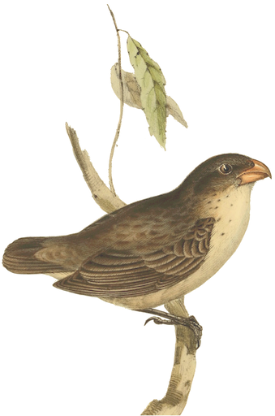
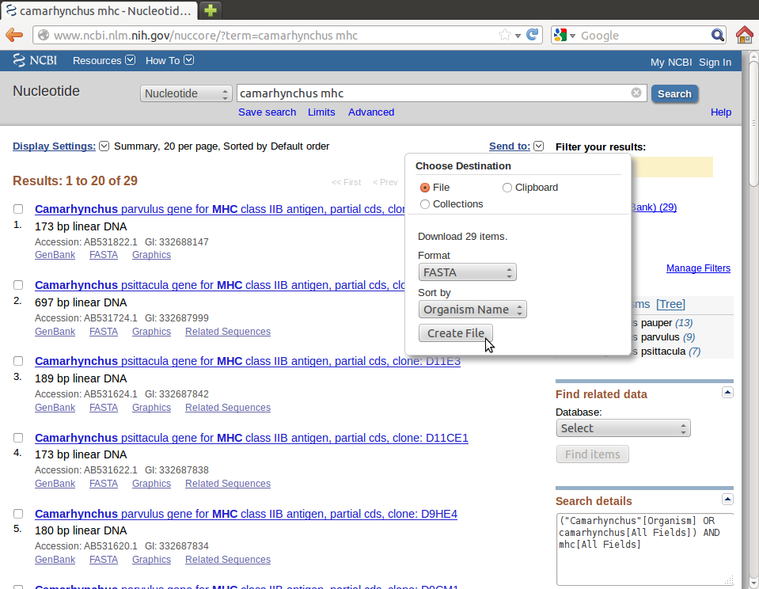
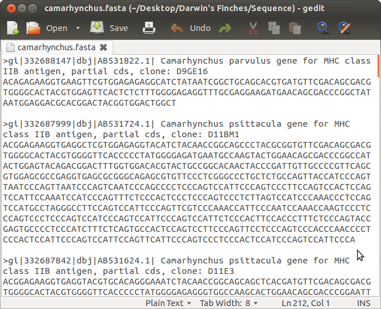
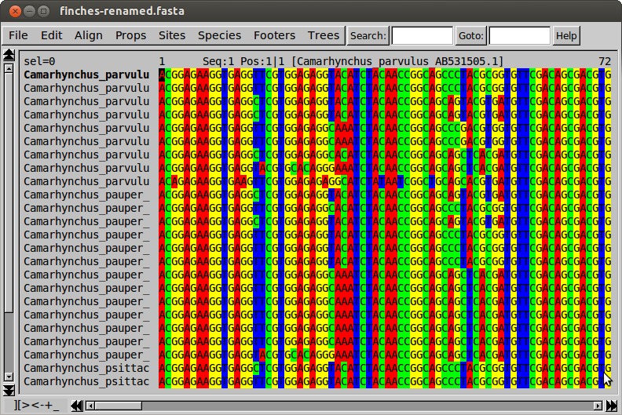
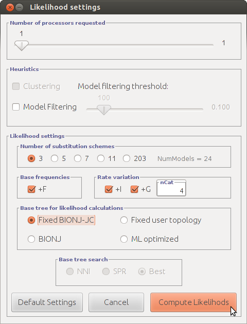
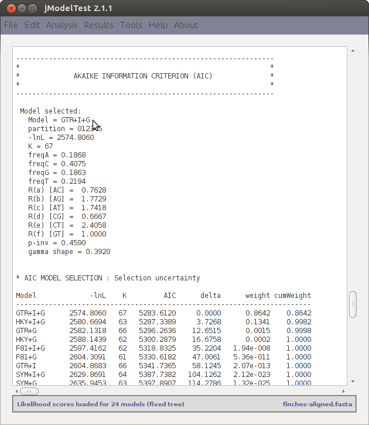
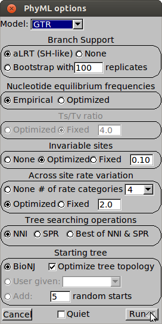
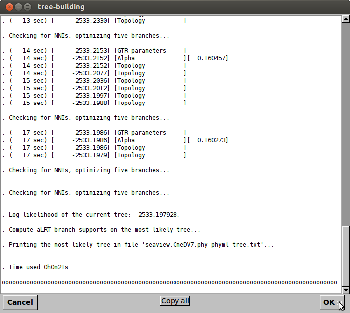
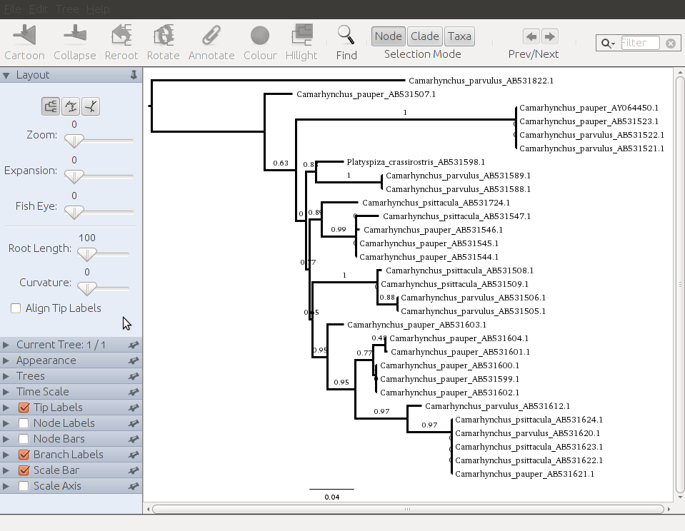

# Intro to Phylogenetics: Darwin's Finches

In this tutorial you will create your first phylogenetic tree. We will
be looking at a genus of Darwin's finches, *Camarhynchus*, as a model
organism.

For this tutorial, you will need the following software (see "Programs
for Phylogenetics"):

- gedit
- FASTA Concatenator
- GenBank Renamer
- SeaView
- PhyML (included in SeaView)
- jModelTest (optional)
- MAFFT
- FigTree

Let's begin by being organized. Create the folder `Darwin's Finches` on
your desktop. You will keep all of the files you create during the
tutorial in this folder.

## Downloading the DNA Sequences

Start by visiting [GenBank](http://www.ncbi.nlm.nih.gov/). At the top
of the page is a search field, with a dropdown menu on the right. Select
`Nucleotide` from the menu, meaning that we want to search GenBank's DNA
database. Then type `camarhynchus mhc` into the search field, where
"mhc" is the three letter code for the major histocompatibility complex
gene, and click `Search`.

A page with 29 search results should come up. Each result is an
individual sequence of the MHC gene, collected by researchers and
uploaded to GenBank. You can see that the sequences come from the
different species of *Camarhynchus*. To use these DNA sequences in our
analysis, we need to download them as a FASTA file. Click `Send to` on
the top-right of the page. Set `Choose Destination` to `File`, and under
`Format` indicate `FASTA`. Although not essential, I recommend
indicating to `Sort by Organism Name`. Click `Create File` and within
moments a FASTA file `sequence.fasta` should download. In your
`Darwin's Finches` folder, create a new folder called `Sequence`. Save
the download `sequence.fasta` in there, and rename it
`camarhynchus.fasta`.

We will also need to download DNA sequence for an organism to use as an
outgroup. An outgroup is a group consisting of at least one other
organism that will be at the root of the phylogenetic tree. Good choices
for outgroups are species that are closely related to the organisms that
you are researching, but distant enough that they does not belong
directly to the research group. *Platyspiza crassirostris* is another
one of Darwin's Finches, however it does not belong to the
*Camarhynchus* genus, making it an appropriate outgroup.

Return to GenBank and ensure that `Nucleotide` is selected, but this
time we will search for a specific species. Search for
`platyspiza crassirostris mhc`, and this time click the checkmark for
only the first result (as we are not studying the genus *Platyspiza*, a
single sequence is a sufficient outgroup). Download this as a FASTA file
in the same manner as above. You can add this to our `Sequence` folder
under the name `outgroup.fasta`.

Before we proceed, let's just take a quick peek at these FASTA files.
Start gedit, and open `camarhynchus.fasta`. You will see that the file
is in standard FASTA format, where each entry starts with a "carrot"
`>`, and the actual DNA sequence of the MHC gene in each bird follows.
You will notice that GenBank has given the taxa long, confusing names—we
will fix this in the next step.

    gi|18307163|gb|AY064450.1| Camarhynchus pauper isolate CapuD10Ai1 MHC class
    IIB antigen gene, exon 2 and partial cds

The first two letter-number combinations, `18307163` and `AY064450.1`,
are known as accessions, or GenBank's unique ID for the sequence. They
are important in case you need to look up a sequence (for example,
should the taxon act strangely in your tree, you will want to check the
GenBank entry for a mistake). Immediately following is the organism's
scientific name, in this case *Camarhynchus pauper*. From this point,
while the order will vary between entries, is generally the following
information. The text `isolate CapuD10Ai1` is another type of accession,
except that it was chosen by the scientists who sequenced the DNA. You
can almost always ignore this, as it is only useful if you are reading
the research article associated with the sequence. The next bit is
important, as it identifies the gene that the DNA represents. As
previously mentioned, `MHC` is the three letter code for the major
histocompatibility complex gene. The phrase `class II B antigen` further
specifies this particular gene's details. Finally, `exon 2` indicates
which part of the gene is sequenced (you will learn more about exons in
your biology class) and `partial cds`, where "cds" abbreviates "conserved domains,"
designates this sequence as only a portion of the overall genetic unit.
You will see `complete cds` when the entire gene has been sequenced.

## Preparing the FASTA File

Prior to creating the DNA sequence alignment, we should do a couple
things. The first is we must combine the two separate FASTA files into a
single file. For that purpose I have created the utility FASTA
Concatenator which we will use in this tutorial. On start, FASTA
Concatenator will ask you to select the files that you want to combine.
Navigate to the `Sequence` folder we created, select both
`camarhynchus.fasta` and `outgroup.fasta` by holding the `shift` key,
and click `Open`. A second window should ask you to save the file. Let's
call it `finches.fasta` and save it in our `Sequence` folder.

We should also rename all the entries in our now combined FASTA file. As
we saw, by default GenBank provides long, confusing names with excessive
information, so it will be preferable to clean this up. My program
GenBank Renamer will do this automatically. When you run GenBank
Renamer, select `finches.fasta` and save it as `finches-renamed.fasta`
in the `Sequence` folder, to keep our original file as a backup. Open
`finches-renamed.fasta` in gedit and you will see that the names have
been fixed.

## Creating the DNA Alignment

Now let's pay some attention to the DNA, which really is the most
important part of our analysis! Run SeaView, and
`File > Open finches-renamed.fasta`. For this particular dataset you
will immediately see that, by chance, the DNA is already lined up quite
well. Any differences between sequences are mutations that have occurred
in the finches' DNA over time. Several sequences appear to share common
mutations, indicating that those finches are probably more closely
related. Phylogeny programs analyze these common mutations to estimate a
phylogenetic tree. It is critical that our DNA is aligned well, as an
incorrect alignment contains false mutations that will throw off your
results.

Despite what appears to already be a very good alignment, we should
apply normal procedure and have the program MAFFT align the DNA
sequences. Select `Align > Alignment options > mafft`. Next, choose
`Align > Align all` and a window should appear indicating the alignment
progress. As this is only a tutorial, MAFFT should suffice; however,
when aligning your own molecular sequences you may decide to use
L-INS-i, a high-accuracy mode in MAFFT. Once it completes, click `OK`.

You can now view the finished alignment. Sure enough, not much appears
to have changed, however as you scroll towards the right you will notice
that MAFFT has introduced gaps, indicated as dashes `-`, to some
sequences. Choose `File > Save as...` and save the alignment as
`finches-aligned.fasta` in the `Sequence` folder. We are now ready to
create the phylogenetic tree!

## Choosing a Substitution Model (optional)

For a phylogeny program to estimate a phylogenetic tree based on your
DNA alignment, your will need to specify an evolutionary model, known as
a (nucleotide or amino acid) substitution model. This substitution model
attempts to describe how nucleotides in the DNA or amino acids in the
protein mutate, or are "substituted" (see "How Phylogeny Programs
Work"). We will use the program jModelTest to test our dataset with
multiple substitution models and tell us which model is the best for our
particular DNA alignment.

Begin by starting jModelTest, and a window should open with a text log.
Select `File > Load DNA alignment`, and open `finches-aligned.fasta`.
Once jModelTest returns
`Reading data file "finches-aligned.fasta"... OK.`, select
`Analysis > Compute likelihood scores`. In the window that opens, the
default settings are generally okay. For the sake of time in this
tutorial, set `Number of substitution schemes` to `3` and
`Base tree for likelihood calculations` to `Fixed BIONJ-JC`. Also, you
may want to increase `Number of processors requested` if possible to
enable jModelTest to run faster. Click `Compute Likelihods` (a typo on
their part; should be `Likelihoods`). This may take a long time, so if
the process is exceeding five minutes I would just `Cancel` and skip
this portion of the tutorial.

Once complete, select `Analysis > Do AIC calculations ...`, leave the
default settings, and click `Do AIC calculations`. jModelTest should
complete the calculations, and select a model. To see the selected
model, you will have to scroll up until you see the heading
`AKAIKE INFORMATION CRITERION (AIC)`. Underneath it will be
`Model = GTR+I+G`, or the general time reversible model, with invariant
sites and gamma rate distribution.

I recommend creating a new file in gedit, typing `GTR+I+G` and saving it
as `model.txt` in `Darwin's Finches` to remind us of the jModelTest
results. Now we are ready to create the phylogenetic tree!

# Creating the Tree

To estimate the phylogeny, we will use the maximum likelihood method as
implemented in the program PhyML. Conveniently PhyML can be run directly
through SeaView. Select `Trees > PhyML` and a window with options should
appear.

One of the categories is for `Branch Support`, which specifies how PhyML
estimates the support for clades, or groups of organisms, within the
final tree based on evidence in the molecular sequence. Bootstrapping
for at least 100 replicates is the preferred support method, where the
program creates and compares trees based on random remixes of your
alignment. For the sake of speed in this tutorial, though, we will leave
the default setting of `aLRT`.

Most of the other options specify the evolutionary model that PhyML
should use, known as a substitution model. The substitution model
describes how DNA or amino acids change over time. You will eventually
learn how to choose the right model settings with the program
jModelTest, but for this tutorial the default settings should be fine,
so you can click `Run`. Similar to when we ran MAFFT, a window should
appear indicating PhyML's progress.

When the analysis completes, click `OK` and a window will appear with
the results. This is your phylogenetic tree! Although we can view the
tree in SeaView, for now we will `File > Save rooted tree` as
`finches.tre` in `Darwin's Finches`.

**Note: Because PhyML uses a stochastic, or random, process, your
results will not match exactly with mine.**

## Visualizing the Tree

Now that you have your phylogenetic tree, you will want to inspect it to
analyze the validity of the results and eventually prepare a visual for
presentation. Run the program FigTree and open `finches.tre`. A window
will appear asking you to select a name for values in the tree. Type
`aLRT` and click `OK`. Your tree will appear again, in full glory.

Before we inspect our results, let's optimize the tree for viewing. In
FigTree's left sidebar there are a number of settings we can use to
change the appearance of the tree. For now, try the settings below:

- Under `Appearance` set `Line Weight` to `3`
- Under `Trees`, check `Order nodes`
- Under `Tip Labels` you may want to click `Font` and increase the
  `Size` to `12`
- Check `Branch Labels`, and underneath it set `Display` to `aLRT`,
  and increase the `Font Size` to `10`
    
The tree should look something like this now:

Let's now take a critical eye to the tree. It certainly has a number of
good qualities. The `Branch Labels`, or the decimals above the branches,
are aLRT values, indicating the support for a particular clade in the
tree. Usually values of at least 0.8 indicate good support, with values
greater than 0.9 ideal. Several clades of the tree have support of at
least 0.9, meaning that they are well-supported. Additionally, in
general, finches of the same species are grouped together, as you would
expect.

However, there are also quite a bit of problems with this tree. For
example, our intended outgroup *Platyspiza crassirostris* is not the
outgroup identified by PhyML, and instead is within the tree! That means
it was probably not a good choice as an outgroup, and we will want to
select a different organism. Also, there are quite a few clades lacking
good support (<0.8), and in some cases finches of difference species
are grouped together, which normally is not right. These issues may be
the result of mistakes in the sequence alignment, or the gene itself may
not be the best choice for a phylogenetic analysis. However, this is the
usual cycle of problems and potential solutions you should expect to
encounter while doing your own phylogeny project. Even in a tutorial not
everything can go perfectly!

Currently we are viewing the tree in a format known as a phylogram where
the lengths of the branches indicate the amount of substitution
(mutations) that have occurred between taxa, by the scale at the bottom.
You will notice that between some taxa there are little or no
differences, making it impossible to infer their relationships. That's
not a good sign, and suggests that the gene we selected has not mutated
enough to be phylogenetically useful for our analysis.

We can also view the tree as a cladogram, which illustrates strictly the
relationships between the taxa. To do so, uncheck `Scale Bar` and under
`Trees` check `Transform branches`. The tree should become a cladogram,
making it easier to read the aLRT values.

Despite the imperfection of our results, I recommend that you go ahead
and play with FigTree to become familiar with it. For example, under
`Layout`, try the `Polar` or `Radial` modes. Switch the `Selection Mode`
to `Clade` on the top toolbar, and select a clade by clicking on a
branch of the tree. Try `Cartoon` or `Collapse`, and perhaps add a touch
of `Colour`. This is the moment to be artistic! Make sure to `Save` if
you want to maintain the tree's current appearance.

## Closing Remarks

I hope that this tutorial has provided an interesting and informative
introduction to the phylogenetic process. As you learn to use the tools,
you will see that the possibilities for projects are endless. There are
so many organisms you can choose to study, addressing topics in ecology,
epidemiology, paleontology, and genetics, to name a few. Ultimately,
your phylogenetic tree and analysis of it represents a hypothesis of the
evolutionary processes that have shaped your organism.
